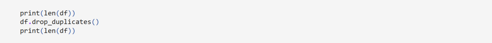
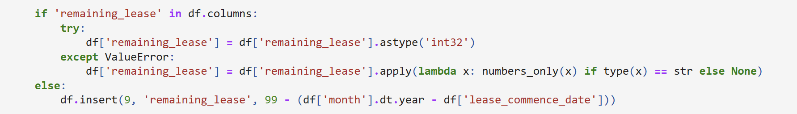
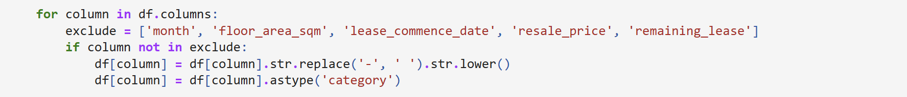
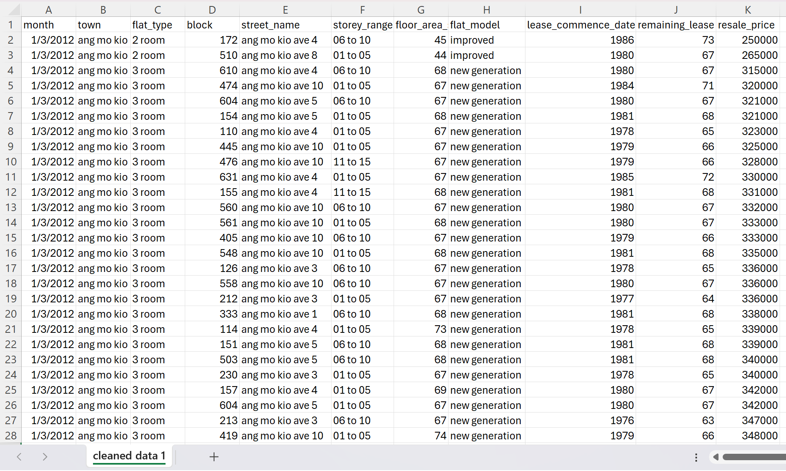
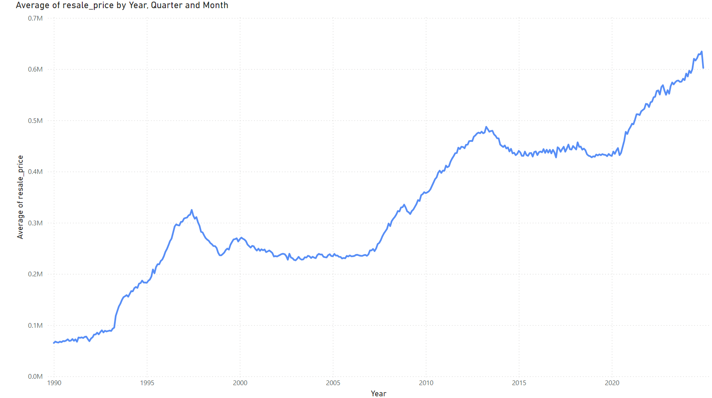
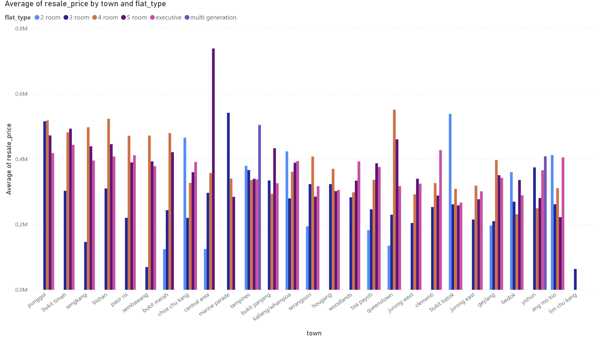
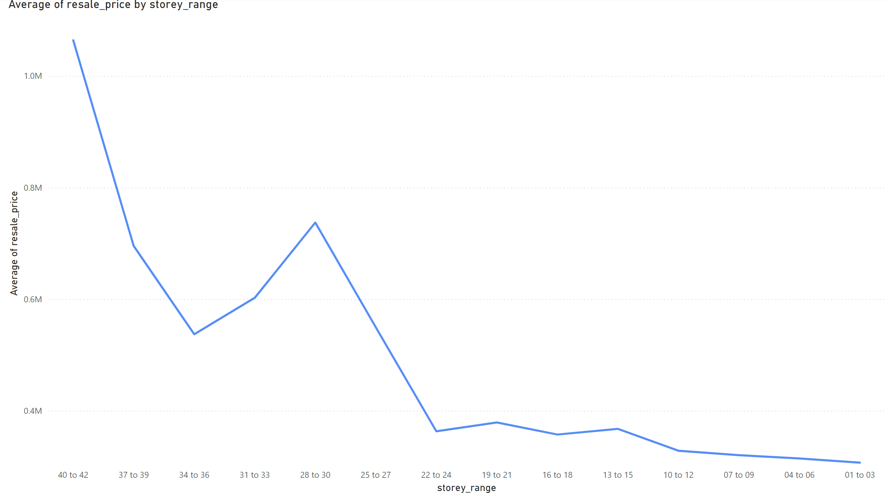

# HDB Resale Housing Prices Analysis

This project explores HDB resale housing prices in Singapore. The dataset was sourced from [data.gov.sg](https://data.gov.sg/collections/189/view). There were 5 csv files comprising over 900, 000 resale flat prices from 1990 to 2024 and 10 input variables such as flat types and towns.

---

## Introduction

The aim of this analysis is to understand trends in HDB resale prices, the factors influencing them and the economic reasoning behind these relationships. I first cleaned the data before creating the visualisations based on the dataset and analysing the trends. 

---

## Data Cleaning in Python

I used the pandas library to clean the dataset by first dropping duplicate rows if there were any.

Next, some csv files did not have the 'remaining_lease' column, hence I inserted the column and calculated the remaining lease for the flats given that all HDB flats have a lease of 99 years.

Lastly, I standardised the terminology for columns such as 'flat_type' as mixed terminology across files, such as '2-room' and '2 room' or 'apartment' and 'APARTMENT', led to flats having separate categories despite having the same features. Hence, I replaced all the hyphens with spaces and lower-cased all the letters.

---

## Transferring Data to PostgreSQL and Power BI

After data cleaning, I saved the cleaned data as new csv files. 

I then used the psycopg2 database adaptor to create a connection between Python and PostgreSQL and created table queries to insert the data into PostgreSQL. I then used the data in PostgreSQL to create visualisations below in Power BI.

---

## Resale Prices over the Years

We start of by analysing the changes in resale prices over the years.

The line graph above shows the **average resale prices over time** from 1990 to 2024 and there has been a large increase in average resale prices in the past 34 years. This is on top of a significant dip in the second half of 1997 to the end of 1998 due to the [Asian Financial Crisis](https://www.nlb.gov.sg/main/article-detail?cmsuuid=6a94eaac-75ec-41ff-b5ef-38154ccae4e0#:~:text=What%20began%20as%20a%20currency,the%20second%20half%20of%201998.), which was caused by the collapse of the Thai Baht in July 1997. Singapore suffered from the spillover effect of economic slowdown and fell into a recession. The reduced growth and closure of companies, the increase in unemployment and the fall in stock prices led to a decrease in demand for properties. Resale flats were no exception since consumers have little to no source of income, which reduced their purchasing power and incentive to purchase resale flats since they prioritised saving.

The second significant decrease was in April of 2013 due to cooling measures implemented by the Singapore government on the property market. [For public housing](https://www.mas.gov.sg/news/media-releases/2013/additional-measures-to-ensure-a-stable-and-sustainable-property-market), the eligibility for loans to purchase HDB flats was tightened and more restrictions were enforced on permanent residents (PRs) that own HDB flats. The lower loan eligibility once again lowered consumers' purchasing power while the tighter restrictions discourages PRs from buying a HDB flat, decreasing demand for resale flats and hence, the price decreased. (got a bunch of stats, dk if should include) Average resale flat prices only returned to an increasing trend from June 2020 when circuit breaker due to COVID-19 was coming to an end.

My analysis as to why average resale prices have increased by over $500, 000 in the past 34 years stems from a few reasons. Firstly, as Singapore continues to develop from the 1990s, consumer's quality of life and standard of living has increased, hence consumer spending increases and aggregate demand increases. There is a time lag between increases in aggregate demand and increases in long run aggregate supply, which stems from factors like technological advancements and labour productivity, hence general price levels increase over time and small levels of inflation are always present. Inflation leads to consumers being able to purchase less with the same amount of money, hence the Singapore dollar depreciates over time and a larger amount of money is required to purchase the same item, as shown in the increase in resale flat prices over the years.

---

## Resale Prices and Flat Types by Town

Next, we look at how resale prices differ based on location and the type of flat bought.

The bar chart above displays the **average resale prices of different towns and flat types in Singapore**, which helps us understand the regional distribution of resale flat prices. Based on the bar chart, more central towns such as Queenstown and Bukit Timah have higher average resale prices for larger flats such as 4-room and 5-room flats, while less central towns such as Yishun and Tampines have higher average resale prices for smaller flats such as 2-room and 3-room flats. Interestingly, while Punggol is considered a less central town, its average resale prices are always one of the highest regardless of flat type.

Possible reasons for this trend include the fact that living more central towns leads to increased ease of travelling, hence there is a larger range of accessible locations and amenities. Those with families tend to prefer such area due to its convenience, hence the average resale prices for larger flats in more central towns are higher. On the other hand, young couples without children or those that live alone tend to opt for smaller flats in less expensive towns to save money, hence average resale prices for smaller flats are higher in less central towns.

As for why Punggol's average resale prices are one of the highest across all flat types despite being a less central town, it could be due to the government's efforts to increase travelling convenience from Punggol to the rest of Singapore. [On top of the variety of amenities and the MRT and LRT stations, the government is in the process of building the Cross-Island MRT line](https://www.businesstimes.com.sg/property/do-new-hdb-estates-outperform-resale-punggol-data-suggests-so), which will link Punggol to many other areas that are currently very inaccessible through public transport. The projected increase in accessibility likely appeals to many consumers, hence the high average resale prices.

---

## Resale Prices across Storeys

Lastly, I analysed the relationship between the storey range of resale flats (e.g., 1st to 3rd storey) with resale prices. The line graph below depicts the trend.

From the graph, it can be seen that as the flat storey increases, the average resale price increases and the increase in average research price is steeper for higher storeys than lower ones. Even HDB considers high storey heights a ["more attractive attribute" that leads to higher pricing in BTO flats](https://www.hdb.gov.sg/about-us/news-and-publications/publications/hdbspeaks/how-bto-flats-are-priced), yet higher storeys continue to run out before lower storeys. 

This is due to Singaporean's tastes and preferences when it comes to buying a flat. [Higher storeys is associated with better window views, increased privacy, reduced noise and pests as well as a more cooling environment due to less wind blockage by nearby buildings.](https://mothership.sg/2021/03/high-hdb-floors-sg-experience/) Hence, higher storeys have a higher demand from consumers and have higher average resale prices due to higher willingness to pay. The high price, in turn, further increases demand for higher storeys as higher resale value is seen as an additional benefit for consumers who plan to sell their flat in the future.

---

## Conclusion

The analysis reveals that resale prices have steadily increased over the years in spite of a few dips. The distribution of flat types and regional disparities shows that prices are not as clear-cut as,"All central flats are expensive and all non-central flats are cheap." Lastly, storey range has a significant impact on resale prices due to the perceived benefits that comes with living in higher storeys such as better living conditions and higher resale value. This project has provided me with a lot of insights into Singapore's resale market as I have a better understanding of what consumers prioritise when it comes to housing, and I hope to further break down the data in future projects.

---